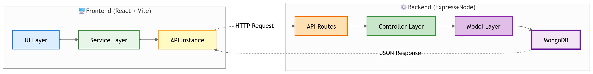
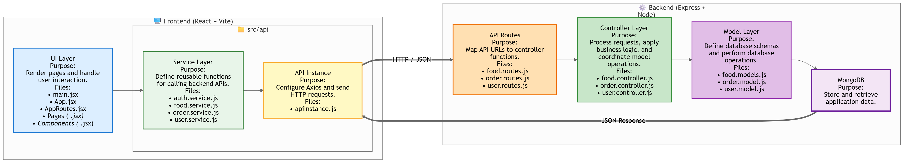

# A complete system Build Order — Quick Notes


 
 
## Backend

**1. Model** — Define schema (data shape) in `model.js`

**2. Controller** — Write functions that talk to the DB in `controller.js`
No HTTP method used here. Just takes `(req, res)` and runs.

```js
export const createOrder = async (req, res) => {
  console.log("REQUEST BODY:", req.body);

  const userId = req.user._id;
  const foods = req.body.foods;

  const order = await orderModel.create({ userId, foods });

  res.status(201).json({
    message: "order created",
    order,
  });
};
```

**3. Routes** — Map a URL + HTTP method to the controller function
Only place on the backend where GET/POST/etc. is written.

---

## Frontend

**1. API Instance** — Set up axios so it knows which backend server to talk to

**2. Service layer** — Write functions that call the backend using HTTP methods (GET, POST, etc.)
Matches whatever method + URL was set in `routes.js`. Never calls the controller function directly — only its URL.

```js
export const createOrder = async (data) => {
  try {
    const res = await api.post("/orders/create", data);
    console.log("Order Created Success:", res.data);
    return res.data;
  } catch (error) {
    console.error("Failed to create order:", error.response?.data || error.message);
    throw error;
  }
};
```

---

## Summary

Backend: **Model** (data shape) → **Controller** (logic) → **Routes** (URL + method)

Frontend: **API Instance** (connection) → **Service** (calls URL + method matching the route)